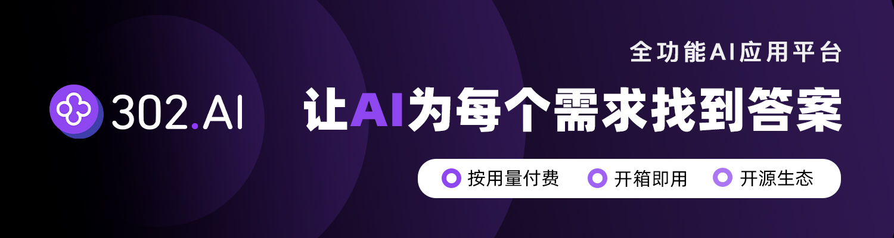

# 🦄 Sponsors

## 302.AI

302.AI 是一个按需付费的一站式 AI 应用平台，开放平台，开源生态。

> 302.AI 开源工具啦：https://github.com/302ai

1. 集合了最新最全的 AI 模型和品牌，包括但不限于语言模型、图像模型、声音模型、视频模型。
2. 在基础模型上进行深度应用开发，做到让小白用户都可以零门槛上手使用，无需学习成本。
3. 零月费，所有功能按需付费，全面开放，做到真正的门槛低，上限高。
4. 创新的使用模式，管理和使用分离，面向团队和中小企业，一人管理，多人使用。
5. 所有 AI 能力均提供 API 接入，所有应用开源支持自行定制（进行中）。
6. 强大的开发团队，每周推出 2-3 个新应用，平台功能每日更新。

简单总结一下就是：

1. 国内可以直接访问 OpenAI 服务 API
2. 按量付费，支持使用支付宝和微信支付
3. 支持 OpenAI、Claude、Midjourney、Suno 等主流 AI 产品

对于个人开发者和编程小白来说，在国内使用还是挺香的，省去了自己注册海外账号和使用信用卡付费的麻烦。

如果你感兴趣，可以使用我的 [邀请链接](https://gpt302.saaslink.net/gOXSrn) 注册体验一下，感谢支持 ❤️

### 重磅 🎉

除此之外，302.AI 也为 `MiGPT` 提供了一个大模型[在线体验网站](https://idootop-all.tools302.com?pwd=8303)，在这里你可以：

1. 免费使用 Midjourney V6 作图
2. 免费获取 OpenAI 等大模型体验 API_KEY
3. 免费使用 GPT-4o, Claude3 Opus, Llama3-70B 等 TOP 模型

快来免费体验吧！

链接: https://idootop-all.tools302.com 分享码: 8303

> 注意：该网站每天有总计 $5 的免费额度（0 点自动刷新），用完即止。
